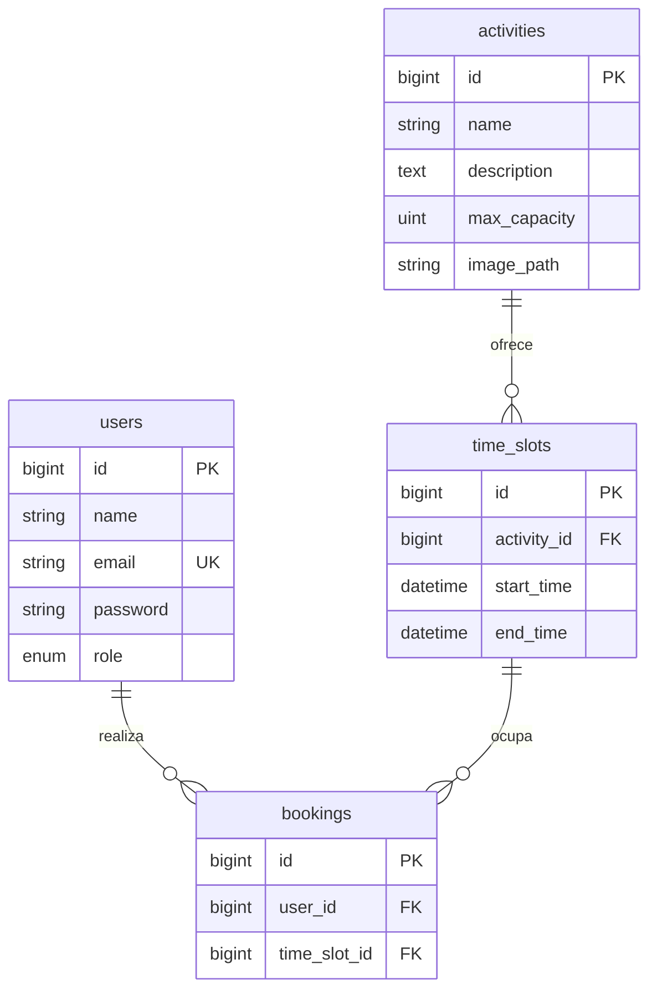

# Especificación técnica: Backend (Core + Funcional)

Centro deportivo — reservas. Stack: **Laravel 12**, **MariaDB**, **Docker** (contenedor `deportivo-app`), **Laravel Breeze (Blade + Vite)**.

Este documento describe la arquitectura implementada, las reglas de negocio, la seguridad por capas, **el manual de operación en equipo** (Git, pruebas, políticas) y **dónde debe actuar el frontend** (vistas Blade, variables inyectadas y rutas nombradas).

---

## 1. Estructura del repositorio (dónde está cada cosa)

| Ubicación | Contenido |
|-----------|-------------|
| [`TW-Grupo-5/src/`](../src/) | Aplicación Laravel (raíz `artisan`, `app/`, `routes/`, `resources/`, `database/`, etc.) |
| [`TW-Grupo-5/src/app/Models/`](../src/app/Models/) | Modelos Eloquent: `User`, `Activity`, `TimeSlot`, `Booking` |
| [`TW-Grupo-5/src/app/Http/Controllers/`](../src/app/Http/Controllers/) | Controladores web; subcarpeta `Admin/` para panel de administración |
| [`TW-Grupo-5/src/app/Http/Middleware/CheckRole.php`](../src/app/Http/Middleware/CheckRole.php) | Middleware de autorización por rol |
| [`TW-Grupo-5/src/routes/web.php`](../src/routes/web.php) | Rutas HTTP de negocio y agrupación por middleware |
| [`TW-Grupo-5/src/routes/auth.php`](../src/routes/auth.php) | Rutas de Breeze (login, registro, verificación de email, contraseña) |
| [`TW-Grupo-5/src/resources/views/`](../src/resources/views/) | Vistas Blade (público, catálogo, admin, reservas, Breeze) |
| [`TW-Grupo-5/src/database/migrations/`](../src/database/migrations/) | Esquema de BD |
| [`TW-Grupo-5/src/database/seeders/DatabaseSeeder.php`](../src/database/seeders/DatabaseSeeder.php) | Datos de demostración |
| [`TW-Grupo-5/docs/campos-api.md`](campos-api.md) | Resumen de campos y credenciales demo |

---

## 2. Arquitectura de datos

### 2.1. Por qué `time_slots` y no `sessions`

La tabla **`sessions`** del proyecto (migración inicial de Laravel) es la **sesión HTTP** (payload del usuario en el servidor). El dominio de negocio usa la tabla **`time_slots`** para franjas reservables, evitando colisión de nombres con el sistema de sesiones de Laravel y con el facade `Session`.

### 2.2. Diagrama entidad-relación (lógico)



### 2.3. Tablas y restricciones

| Tabla | Descripción | Detalles relevantes |
|-------|-------------|---------------------|
| `users` | Identidad y rol | `role`: valores `normal`, `admin` (enum en migración). Contraseña con cast `hashed`. |
| `activities` | Recurso / actividad | `max_capacity`: aforo por turno. `image_path`: ruta en disco `public` (p. ej. `activities/...`). |
| `time_slots` | Disponibilidad temporal | `activity_id` FK con `cascadeOnDelete`. Índice `(activity_id, start_time)`. |
| `bookings` | Reserva concreta | `UNIQUE(user_id, time_slot_id)` evita doble reserva del mismo hueco. FKs con `cascadeOnDelete` hacia `users` y `time_slots`. Índice en `time_slot_id` para conteos de aforo. |

Migraciones: [`0001_01_01_000000_create_users_table.php`](../src/database/migrations/0001_01_01_000000_create_users_table.php) (usuarios + tablas framework de sesión HTTP), [`2026_04_28_000001_create_activities_time_slots_bookings_tables.php`](../src/database/migrations/2026_04_28_000001_create_activities_time_slots_bookings_tables.php).

### 2.4. Modelos Eloquent y relaciones

| Modelo | Relaciones principales | Notas |
|--------|------------------------|--------|
| `User` | `hasMany(Booking::class)` | `isAdmin(): bool` (`role === 'admin'`). `$fillable` incluye `role`. |
| `Activity` | `hasMany(TimeSlot::class)` como `timeSlots()` | `$fillable`: name, description, max_capacity, image_path. |
| `TimeSlot` | `belongsTo(Activity)`, `hasMany(Booking)` | Casts `datetime` en `start_time`, `end_time`. `isFull()` compara conteo de reservas con `activity->max_capacity`. |
| `Booking` | `belongsTo(User)`, `belongsTo(TimeSlot)` | `$fillable`: user_id, time_slot_id. |

**Utilidades en `TimeSlot`:**

- `TimeSlot::overlapsForActivity($activityId, $start, $end, $exceptId?)`: usada en el **admin** al crear/editar turnos para impedir solapes entre franjas de la **misma actividad** (intervalos: `start_time < finNuevo AND end_time > inicioNuevo`).
- `scopeWithAvailability($query)`: filtra turnos cuyo número de `bookings` es **menor** que `activities.max_capacity` (subconsultas SQL). Útil para APIs o listados “solo con plaza”; el catálogo actual lista todos los turnos futuros y oculta el botón si está lleno.

---

## 3. Lógica de negocio (reservas y administración)

### 3.1. Tres capas de “usuario” (acceso)

No son tres filas en BD distintas para “anónimo”; son **tres perfiles de acceso**:

1. **Anónimo (no autenticado):** sin fila en `users` para la petición; rutas públicas sin `auth`.
2. **Socio (`role = normal`):** autenticado vía Breeze; puede reservar y ver **mis reservas**.
3. **Administrador (`role = admin`):** autenticado, email verificado (rutas admin con `verified`) y paso por middleware `role:admin`.

### 3.2. Creación de reserva (`BookingController@store`)

Archivo: [`app/Http/Controllers/BookingController.php`](../src/app/Http/Controllers/BookingController.php).

1. **Validación HTTP** fuera de la transacción: `time_slot_id` requerido, entero, `exists:time_slots,id`.
2. **Transacción** `DB::transaction` que **devuelve** el `RedirectResponse` al finalizar con éxito (commit implícito). Los fallos de negocio lanzan `ValidationException` (rollback automático).

Dentro de la transacción, en orden aproximado:

| Paso | Qué hace |
|------|-----------|
| Bloqueo | `TimeSlot::whereKey($id)->lockForUpdate()->first()` para serializar decisiones sobre ese turno. |
| Existencia / tiempo | Si no hay slot o `end_time` ya pasó → `ValidationException`. |
| Aforo | `Booking::where('time_slot_id', ...)->lockForUpdate()->count()` comparado con `activity.max_capacity`. |
| Mismo turno | Si ya existe reserva del mismo usuario en ese `time_slot_id` → `ValidationException`. |
| Solape temporal (mismo socio, otro turno) | Consulta reservas del usuario con `whereHas('timeSlot', ...)` usando la condición de intervalo solapado (equivalente a \(S_1 < E_2\) y \(E_1 > S_2\)): en SQL: `time_slots.start_time < :finNuevo AND time_slots.end_time > :inicioNuevo` con `:finNuevo = $slot->end_time` e `:inicioNuevo = $slot->start_time`. |
| Inserción | `Booking::create([...])` y `return redirect()->route('bookings.index')->with('status', ...)`. |

La restricción **UNIQUE** en BD refuerza la integridad ante carreras en el mismo hueco.

**Mensajes de error expuestos al usuario (Blade):** tabla en **§10.4** (`time_slot_id` para `store`, `cancel` para `destroy`).

### 3.2.1. Cancelación de reserva por el socio (`BookingController@destroy`)

- Ruta: `DELETE /reservas/{booking}` → nombre `bookings.destroy` (middleware `auth`).
- Autorización: [`BookingPolicy::delete`](../src/app/Policies/BookingPolicy.php) registrada en [`AppServiceProvider`](../src/app/Providers/AppServiceProvider.php); en el controlador se usa `$this->authorize('delete', $booking)` (trait `AuthorizesRequests` en `BookingController`). Solo el **dueño** de la reserva puede borrarla; otro usuario recibe **403**.
- **Regla de negocio explícita (decisión de producto):** no se puede cancelar si el turno **ya ha comenzado** (`time_slot.start_time` es anterior a “ahora”). Se prefiere `start_time` frente a `end_time` para evitar cancelaciones cuando la actividad ya está en curso (centros deportivos reales). Si aplica, se devuelve `back()->withErrors(['cancel' => '...'])` para que el front use `@error('cancel')`.
- Efecto: al eliminar la fila en `bookings`, el aforo del turno se recalcula solo (conteo de filas); no hace falta lógica adicional para “liberar plaza”.

### 3.3. Administración de turnos (solape por actividad)

Archivo: [`app/Http/Controllers/Admin/TimeSlotController.php`](../src/app/Http/Controllers/Admin/TimeSlotController.php).

Al crear o actualizar un `TimeSlot`, se llama a `TimeSlot::overlapsForActivity(...)` para que **dos franjas de la misma actividad** no se solapen (coherencia del calendario ofertado).

### 3.4. Actividades e imágenes

Archivo: [`app/Http/Controllers/Admin/ActivityController.php`](../src/app/Http/Controllers/Admin/ActivityController.php).

- Subida con `Storage::disk('public')->` (`store('activities', 'public')`).
- Se guarda solo `image_path` en BD; en vistas públicas se usa `Storage::url($activity->image_path)`.
- Requiere `php artisan storage:link` en despliegue.

---

## 4. Seguridad y middleware

### 4.1. Laravel Breeze

- Login, registro, logout, verificación de email, reset de contraseña.
- Rutas en [`routes/auth.php`](../src/routes/auth.php).
- Registro: nuevos usuarios con `role = normal` y contraseña respetando el cast `hashed` del modelo (no doble hash manual).

### 4.2. `CheckRole`

Archivo: [`app/Http/Middleware/CheckRole.php`](../src/app/Http/Middleware/CheckRole.php). Registro del alias `role` en [`bootstrap/app.php`](../src/bootstrap/app.php).

- Si no hay usuario autenticado: `redirect()->guest(route('login'))`.
- Si el `role` del usuario no está en la lista de roles permitidos del middleware: `403`.

Uso en rutas: `middleware(['auth', 'verified', 'role:admin'])` en el prefijo `/admin`.

**Importante:** el “anónimo” no pasa por `CheckRole`; las rutas públicas no usan este middleware. La separación anónimo / socio / admin es por **combinación** de `guest`, `auth`, `verified` y `role:admin`.

### 4.3. `BookingPolicy` (autorización sobre reservas)

Archivo: [`app/Policies/BookingPolicy.php`](../src/app/Policies/BookingPolicy.php).

- Método `delete(User $user, Booking $booking): bool`: solo `true` si `$user->id === $booking->user_id`.
- Uso: `$this->authorize('delete', $booking)` en `BookingController@destroy`, desacoplando la regla de seguridad del resto de la lógica.

### 4.4. Validación de entradas

- Reservas y formularios admin: validación con `$request->validate([...])` en controladores (tipos, `min:1` en capacidades, fechas `after:start_time`, imágenes `image|max:4096`, etc.).

---

## 5. Rutas HTTP y nombres (referencia rápida)

### 5.1. Públicas (sin `auth`)

| Método | URI | Nombre | Controlador |
|--------|-----|--------|---------------|
| GET | `/` | `home` | `HomeController` (invocable) |
| GET | `/actividades` | `activities.index` | `CatalogController@index` |
| GET | `/actividades/{activity}` | `activities.show` | `CatalogController@show` |
| GET | `/contacto` | `contact` | `ContactController` (invocable) |

### 5.2. Autenticado (`auth`)

| Método | URI | Nombre | Controlador |
|--------|-----|--------|---------------|
| GET | `/mis-reservas` | `bookings.index` | `BookingController@index` |
| POST | `/reservas` | `bookings.store` | `BookingController@store` |
| DELETE | `/reservas/{booking}` | `bookings.destroy` | `BookingController@destroy` |

También perfil Breeze: `profile.edit`, `profile.update`, `profile.destroy` (ver `web.php`).

### 5.3. Dashboard Breeze

| Método | URI | Nombre | Middleware |
|--------|-----|--------|------------|
| GET | `/dashboard` | `dashboard` | `auth`, `verified` |

### 5.4. Administración (`auth`, `verified`, `role:admin`, prefijo `admin.`)

`Route::resource('activities', ...)` sin `show`:

| Verbo | URI | Nombre |
|-------|-----|--------|
| GET | `/admin/activities` | `admin.activities.index` |
| GET | `/admin/activities/create` | `admin.activities.create` |
| POST | `/admin/activities` | `admin.activities.store` |
| GET | `/admin/activities/{activity}/edit` | `admin.activities.edit` |
| PUT/PATCH | `/admin/activities/{activity}` | `admin.activities.update` |
| DELETE | `/admin/activities/{activity}` | `admin.activities.destroy` |

Recurso anidado `activities.time-slots` con **scoped binding** (`time_slot` acotado por `activity_id`):

| Verbo | URI | Nombre (patrón) |
|-------|-----|-----------------|
| GET | `/admin/activities/{activity}/time-slots` | `admin.activities.time-slots.index` |
| GET | `/admin/activities/{activity}/time-slots/create` | `admin.activities.time-slots.create` |
| POST | `/admin/activities/{activity}/time-slots` | `admin.activities.time-slots.store` |
| GET | `/admin/activities/{activity}/time-slots/{time_slot}/edit` | `admin.activities.time-slots.edit` |
| PUT/PATCH | `/admin/activities/{activity}/time-slots/{time_slot}` | `admin.activities.time-slots.update` |
| DELETE | `/admin/activities/{activity}/time-slots/{time_slot}` | `admin.activities.time-slots.destroy` |

Comprobar nombres exactos en cualquier momento: `php artisan route:list`.

---

## 6. Guía de integración para frontend (Blade)

### 6.1. Layouts

| Layout / componente | Uso |
|---------------------|-----|
| [`resources/views/layouts/public.blade.php`](../src/resources/views/layouts/public.blade.php) | Páginas públicas: inicio, catálogo, contacto. Muestra `@yield('content')`, enlaces a rutas nombradas, `session('status')` y `$errors`. |
| [`resources/views/layouts/app.blade.php`](../src/resources/views/layouts/app.blade.php) + `<x-app-layout>` | Área autenticada Breeze: dashboard, perfil, **mis reservas**, **admin**. |
| [`resources/views/layouts/navigation.blade.php`](../src/resources/views/layouts/navigation.blade.php) | Menú superior autenticado (enlaces a catálogo, contacto, reservas, admin si `isAdmin()`). |

### 6.2. Variables inyectadas por vista (dónde “tocar”)

| Vista | Variables clave | Notas |
|-------|-----------------|--------|
| `home.blade.php` | (ninguna obligatoria) | Texto estático + enlaces `route('activities.index')`, etc. |
| `catalog/index.blade.php` | `$activities` | Paginador Laravel; cada ítem: `$activity->name`, `description`, `max_capacity`, `image_path` + `Storage::url(...)` si hay imagen. |
| `catalog/show.blade.php` | `$activity`, `$timeSlots` | `$activity` como en index. Cada `$slot`: `start_time`, `end_time` (Carbon), `bookings_count` (por `withCount` en el controlador). Comparar con `$activity->max_capacity` para “lleno”. |
| `contact.blade.php` | — | Contenido estático. |
| `bookings/index.blade.php` | `$bookings` | Paginado; cada `$booking`: relaciones `timeSlot.activity`. Botón **Cancelar**: formulario `DELETE` a `route('bookings.destroy', $booking)` solo si `timeSlot->start_time` es futuro; `@error('cancel')` para reglas de cancelación. |
| `admin/activities/*.blade.php` | `$activities` o `$activity` | Formularios con `@csrf`, `@method('PUT')` en edición. |
| `admin/time-slots/*.blade.php` | `$activity`, `$timeSlots` o `$timeSlot` | Turnos ligados a una actividad. |

**Formulario de reserva (desde catálogo):** POST a `route('bookings.store')` con `@csrf` y campo oculto `name="time_slot_id"` (valor = id del turno). No existe la ruta `reservar.store`; el nombre correcto es **`bookings.store`**.

### 6.3. Mensajes de éxito y error

- **Éxito genérico:** `session('status')` (p. ej. tras crear reserva o CRUD admin).
- **Errores de validación:** bolsa `$errors`. En **crear** reserva el campo principal es **`time_slot_id`**. En **cancelar**, errores de negocio usan la clave **`cancel`**.

```blade
@error('time_slot_id')
    <p class="text-red-600 text-sm">{{ $message }}</p>
@enderror
@error('cancel')
    <p class="text-red-600 text-sm">{{ $message }}</p>
@enderror
```

(No usar `@error('session')` para reservas; no es el nombre del campo.)

### 6.4. Ejemplos de `route()` útiles

```blade
{{ route('activities.index') }}
{{ route('activities.show', $activity) }}
{{ route('bookings.index') }}
{{ route('bookings.store') }}  {{-- método POST --}}
{{ route('bookings.destroy', $booking) }}  {{-- método DELETE --}}
{{ route('admin.activities.index') }}
{{ route('admin.activities.time-slots.index', $activity) }}
{{ route('admin.activities.time-slots.create', $activity) }}
```

---

## 7. Datos de prueba (seeder)

Archivo: [`database/seeders/DatabaseSeeder.php`](../src/database/seeders/DatabaseSeeder.php).

- Usuarios demo (emails normalizados para entorno local): ver también [`docs/campos-api.md`](campos-api.md) y README del repo.
- Cinco actividades con descripciones y `max_capacity` variados.
- Tres `time_slots` por actividad en fechas posteriores a `now()` para que el listado “próximos turnos” del catálogo tenga datos.

Comando típico de reinicio local: `php artisan migrate:fresh --seed`.

---

## 8. Comandos de mantenimiento

| Comando | Finalidad |
|---------|-----------|
| `php artisan migrate` | Aplicar migraciones pendientes. |
| `php artisan migrate:fresh --seed` | **Solo local:** borrar tablas, migrar de cero y cargar seeder. |
| `php artisan storage:link` | Enlace simbólico `public/storage` → `storage/app/public` (imágenes de actividades). |
| `npm install` y `npm run build` (en `src/`) | Compilar assets de Breeze/Vite (Node 20+ recomendado). |

---

## 9. Justificación técnica (entrega / defensa)

- **Separación `time_slots` vs sesión HTTP:** claridad y mantenimiento; evita ambigüedad con el componente de framework `sessions`.
- **`lockForUpdate` + transacción:** reduce condiciones de carrera al completar el último cupo de un turno.
- **Condición de solape en SQL:** delega el filtrado al motor de BD (escalable frente a filtrar colecciones en PHP).
- **UNIQUE `(user_id, time_slot_id)`:** garantía de integridad ante duplicados.
- **Policies y cancelación:** `BookingPolicy` desacopla quién puede borrar una reserva; regla de cancelación por **`start_time`** documentada en §10.3.

---

## 10. Operación en equipo: Git, pruebas y políticas de producto

### 10.1. Flujo de trabajo en Git (recomendación de equipo)

El mayor riesgo en un grupo no es solo el código, sino **pisarse el trabajo** o fusionar cambios que rompen el entorno común.

| Regla | Detalle |
|-------|---------|
| Rama `main` | Solo código **estable** que compile, pase tests (`php artisan test`) y sea revisable en Docker (`docker compose up` + migraciones). |
| Ramas de tarea | Cada integrante trabaja en su rama: `feat/…`, `fix/…`, `docs/…` (ej. `feat/frontend-catalogo`, `fix/permisos-docker`). |
| Pull Requests | Antes de fusionar a `main`, **otro integrante** revisa el PR y, si es posible, valida que la app arranca con Docker y que no rompe flujos críticos (login, catálogo, reserva demo). |

Commits frecuentes y PRs pequeños reducen conflictos y facilitan la revisión.

### 10.2. Pruebas automatizadas (calidad de software)

El proyecto incluye una **suite PHPUnit** ejecutable así:

```bash
docker exec -it deportivo-app php artisan test
```

**Qué cubre hoy la suite (28 tests):** **Laravel Breeze** (autenticación, verificación de email, contraseñas, perfil) y un test de la página de inicio. Además, **`Tests\Feature\BookingCancellationTest`**: un usuario **no** puede borrar la reserva de otro (403); **no** puede cancelar si el turno ya ha comenzado (`start_time` en el pasado, error en clave `cancel`); **sí** puede cancelar su reserva si el turno aún no ha empezado.

**Qué aún no está cubierto por tests automatizados:** reglas de **`bookings.store`** (aforo, solape, `lockForUpdate`) y el middleware `role:admin` en `/admin/*`. Conviene ampliar la suite en iteraciones futuras.

Mantener `php artisan test` en verde antes de abrir o fusionar PRs protege la integridad del código compartido.

### 10.3. Política de cancelaciones (visión de negocio / ADE)

**Regla acordada (implementada):** el socio solo puede cancelar mientras el turno **no haya comenzado**; se usa **`time_slot.start_time`** (no `end_time`) como umbral: una vez `start_time` está en el pasado, no se permite cancelar. Así se evita liberar plazas de actividades ya en curso y se alinea con la práctica habitual en centros deportivos.

**Implementación:** `DELETE /reservas/{booking}` (`bookings.destroy`), `BookingController@destroy`, autorización vía **`BookingPolicy::delete`**. Al eliminar la fila en `bookings`, la plaza vuelve a contarse en el aforo del turno automáticamente.

**Interfaz:** en [`bookings/index.blade.php`](../src/resources/views/bookings/index.blade.php) se muestra el botón Cancelar solo si `start_time` es futuro; el front puede reutilizar la misma ruta desde otras vistas.

### 10.4. Glosario: reservas (`BookingController@store` y `@destroy`)

#### Crear reserva (`store`) — campo `time_slot_id`

| Escenario | Tipo | Mensaje exacto (español) |
|-----------|------|---------------------------|
| ID de turno inválido o inexistente (tras validación inicial `exists`) | `ValidationException` | `El turno no existe.` |
| Turno ya pasado | `ValidationException` | `Este turno ya ha finalizado.` |
| Aforo completo (con transacción + bloqueos) | `ValidationException` | `No quedan plazas en este turno.` |
| El usuario ya tiene reserva en ese mismo turno | `ValidationException` | `Ya tienes una reserva para este turno.` |
| El usuario tiene otra reserva cuyo intervalo se solapa con el turno elegido | `ValidationException` | `Ya tienes otra reserva que se solapa con este horario.` |
| Error de validación HTTP inicial (`time_slot_id` ausente o no entero) | respuesta 422 estándar de Laravel | Mensajes según reglas `validate([...])`. |

#### Cancelar reserva (`destroy`) — campo `cancel` y política

| Escenario | Resultado | Mensaje / código |
|-----------|-----------|------------------|
| Usuario no dueño de la reserva | `403` (policy) | Página de error autorización. |
| Turno ya comenzado (`start_time` pasado) | redirección con error | Clave **`cancel`**: `No puedes cancelar un turno que ya ha comenzado.` |
| Cancelación permitida | redirección con `status` | `Reserva cancelada correctamente.` |

Los formularios deben mostrar `@error('time_slot_id')` y `@error('cancel')` según corresponda.

---

## 11. Referencias cruzadas

- Contrato breve de campos y credenciales: [`campos-api.md`](campos-api.md).
- Guía de puesta en marcha Docker, Node, demo: [`README.md`](../README.md).
- Inventario y ejecución de tests PHPUnit: [`TESTING.md`](TESTING.md).